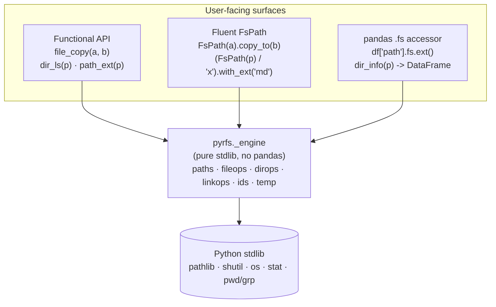
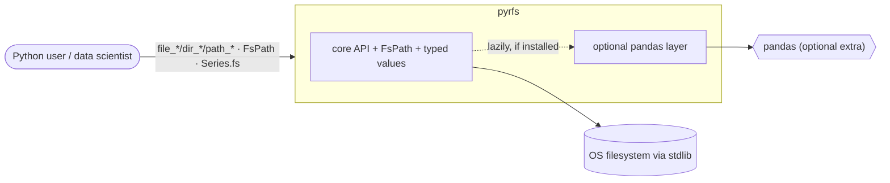
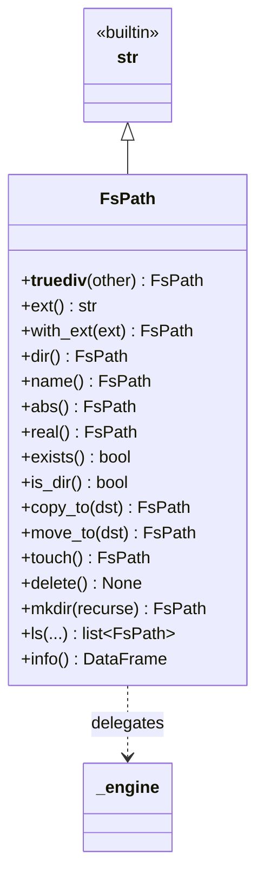
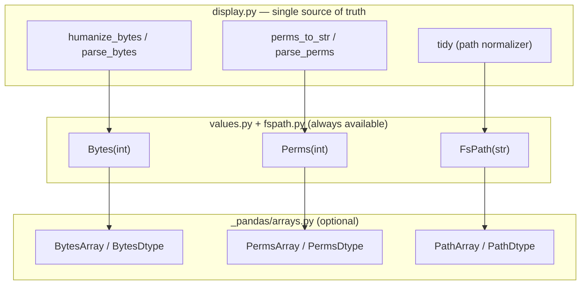
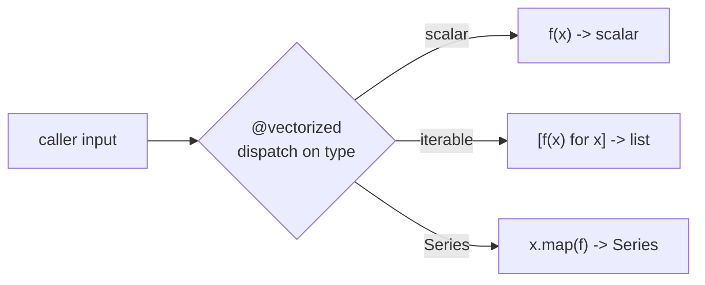
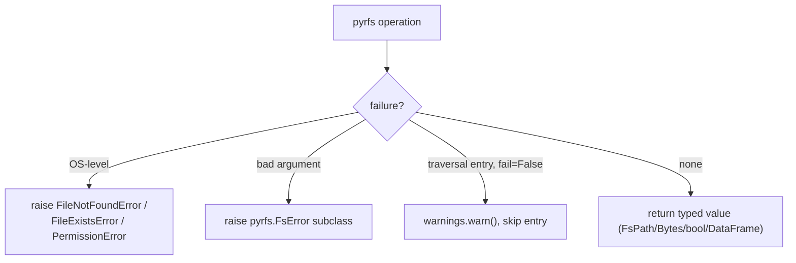

# pyrfs — Architecture

> A Pythonic port of R's [`fs`](https://fs.r-lib.org) · Status: **design draft** · Last updated: 2026-06-11
> Companion: [`pyrfs-ux.md`](./pyrfs-ux.md) (user-facing design) · [`PROGRESS.md`](./PROGRESS.md) (build plan)

---

## 1. Purpose & non-goals

**Purpose.** Give Python the same file-system *ergonomics* that R users enjoy from `fs`:
consistent `noun_verb` naming families, tidy paths, predictable path-carrying return values,
explicit failure, and **typed self-describing values** (human-readable sizes, `rwxr-xr-x`
permissions) — while being **chainable/pipeable** and integrating natively with **pandas**.

**What pyrfs is.** A thin, ergonomic, fully-typed wrapper over the Python standard library
(`pathlib`, `shutil`, `os`, `stat`, `pwd`/`grp`) plus an optional pandas integration layer.

**Non-goals.**
- *Not* a new filesystem abstraction over remote/cloud backends (that's `fsspec`/`PyFilesystem2`).
- *Not* a C/native extension. R's `fs` needed **libuv** for cross-platform syscalls; Python's
  stdlib already abstracts that, so **pyrfs is pure Python** — no build step, trivial install.
- *Not* a 1:1 transliteration. We keep `fs`'s *UX contract*, expressed in idiomatic Python.

---

## 2. Core principle — *one engine, three surfaces*

Every filesystem operation is implemented **once** in a pure-stdlib `_engine`. The three
user-facing surfaces are thin delegations — no logic is duplicated across them.



**Why this matters:** `fs` itself uses this idea — high-level R verbs compose from a small set of
C primitives. pyrfs applies it in pure Python: the fluent object and the pandas accessor are
*presentation layers*, and correctness lives in one place.

---

## 3. System context



- **Inbound:** scripts, notebooks, and packages call pyrfs.
- **Hard dependency:** none beyond the standard library (Python ≥ 3.10).
- **Optional:** pandas — enables `*_info` DataFrames, the `.fs` Series accessor, and the
  ExtensionDtypes. Absent pandas, the core still works and `*_info` returns `list[dict]`.

---

## 4. Package layout (flat layout)

The importable package sits at the **top level** (`pyrfs/pyrfs/`), not under `src/`.

```
pyrfs/                         # repo root
├── pyproject.toml            # setuptools backend, [project], optional-deps, tooling
├── docs/                     # these design docs
├── pyrfs/                     # the importable package
│   ├── __init__.py           # PUBLIC re-exports (functions + FsPath/Bytes/Perms + FsError)
│   ├── py.typed              # PEP 561 marker (ships type info)
│   ├── errors.py             # FsError hierarchy (validation)
│   ├── fspath.py             # FsPath(str) — fluent, chainable           [PUBLIC]
│   ├── values.py             # Bytes(int), Perms(int) — typed scalars     [PUBLIC]
│   ├── display.py            # humanize bytes · perms→rwx · LS_COLORS · tidy
│   ├── _engine/              # pure-stdlib core (NEVER imports pandas)
│   │   ├── paths.py          # path_* algebra
│   │   ├── fileops.py        # file_*
│   │   ├── dirops.py         # dir_*  (ls/map/walk/info/tree/create/copy/delete)
│   │   ├── linkops.py        # link_*
│   │   ├── ids.py            # user_ids/group_ids
│   │   ├── temp.py           # file_temp stack · path_temp
│   │   └── vectorize.py      # polymorphic scalar|iterable dispatch
│   └── _pandas/              # OPTIONAL integration (imported only if pandas present)
│       ├── __init__.py       # registers .fs accessor + ExtensionDtypes
│       ├── dtypes.py         # BytesDtype, PermsDtype, PathDtype
│       ├── arrays.py         # BytesArray, PermsArray, PathArray
│       ├── accessor.py       # @register_series_accessor("fs")
│       └── frames.py         # build *_info DataFrames with typed columns
└── tests/                    # pytest mirror of the package
```

### Module responsibilities

| Module | Responsibility | Depends on |
|--------|----------------|-----------|
| `_engine/paths.py` | Pure path string algebra (`path`, `path_dir`, `path_ext*`, `path_rel`, `path_norm`, …) | `pathlib`, `os.path` |
| `_engine/fileops.py` | `file_create/copy/move/delete/touch/show/chmod/chown/info/size/access` | `shutil`, `os`, `stat` |
| `_engine/dirops.py` | `dir_create/copy/delete/ls/map/walk/info/tree`, recursion & filtering | `os.scandir`, `pathlib` |
| `_engine/linkops.py` | `link_create/copy/delete/exists/path` | `os` |
| `_engine/ids.py` | `user_ids/group_ids` (POSIX; empty frames on Windows) | `pwd`, `grp` |
| `_engine/temp.py` | `file_temp` deterministic stack, `path_temp` | `tempfile` |
| `_engine/vectorize.py` | Decorator mapping scalar funcs over iterables/Series | — |
| `fspath.py` | `FsPath(str)` fluent object; methods delegate to `_engine` | `_engine`, `display` |
| `values.py` | `Bytes(int)`, `Perms(int)` typed scalars | `display` |
| `display.py` | Formatting/parsing: `humanize_bytes`, `parse_bytes`, `perms_to_str`, `parse_perms`, `tidy`, LS_COLORS | stdlib |
| `_pandas/*` | ExtensionDtypes/arrays, `.fs` accessor, DataFrame builders | `pandas`, reuses `display`/`values` |

**Invariant:** `_engine` and `values`/`display` must never `import pandas`. The optional layer
depends inward on them, never the reverse — a classic dependency-inversion boundary.

---

## 5. The three surfaces in detail

### 5.1 Functional API (R-`fs` faithful)

Mirrors `fs`'s families and names exactly: `path_*` (pure, no I/O), `file_*`, `dir_*`, `link_*`,
predicates (`is_file`, `is_dir`, `is_link`, …), `user_ids`/`group_ids`, temp helpers.

- **Predictable returns:** verbs return `FsPath` (or a list/Series of them); predicates return
  `bool` or a vectorized mapping; `file_size` → `Bytes`; `*_info` → DataFrame (or `list[dict]`).
- **Safe defaults** ported verbatim: `overwrite=False`, `recurse` defaults matching `fs`
  (`False` for listing, `True` for `dir_create`), `all=False`, `fail=True`.
- **`recurse: bool | int`** overload — `True`/`False`/depth, exactly like `fs`.

### 5.2 Fluent `FsPath`

`FsPath` **subclasses `str`** — the same choice as R's `fs_path ⊂ character` and the `path`
library. Because an `FsPath` *is* a string, it drops into any stdlib or third-party API that
expects a path, and serializes cleanly into pandas.



Methods return `FsPath` (or lists thereof) so calls chain: `(FsPath("a") / "b").with_ext("txt").copy_to("c")`.

### 5.3 pandas `.fs` accessor + DataFrame returns

- A registered Series accessor gives **vectorized path algebra over a column**:
  `df["path"].fs.ext()`, `.dir()`, `.with_ext("md")`, `.exists()`, `.is_dir()`.
- `dir_info()`/`file_info()` return a DataFrame whose `path`/`size`/`permissions` columns use the
  ExtensionDtypes, so the R headline demo translates directly:

  ```python
  (dir_info("pyrfs", recurse=False)
       .query("size > '10KB' and type == 'file'")
       .sort_values("size", ascending=False))
  ```

---

## 6. Typed value system

Two cooperating tiers, sharing one set of parse/format functions in `display.py`.



### Scalar wrappers (pure stdlib, always present)

| Type | Subclass of | Construct from | Displays as | Overloads |
|------|-------------|----------------|-------------|-----------|
| `Bytes` | `int` | `int`, `"10MB"`, `"1.5GiB"` | `445.2K` | `<,>,==` parse string RHS; arithmetic returns `Bytes` |
| `Perms` | `int` | octal `"644"`, symbolic `"u+rw,go+r"`, int | `rw-r--r--` | `& \| ~` return `Perms`; `==` parses string RHS |
| `FsPath` | `str` | any path-like | tidy path (coloured in terminal) | `/` for join |

Subclassing the builtins mirrors `fs`'s S3-over-atomic-vector design (`fs_bytes ⊂ numeric`,
`fs_perms ⊂ integer`, `fs_path ⊂ character`): a value still behaves like its base type but
*remembers what it is* and prints for humans.

### pandas ExtensionArrays (optional)

For each scalar there is a real `ExtensionArray`/`ExtensionDtype` so DataFrame columns are
first-class typed:

- `BytesDtype` (`name="bytes"`, backing `int64`) — elements show `445.2K`; native `>`/`<`/`==`
  against strings inside `.query()`; `sum`/`min`/`max` reductions.
- `PermsDtype` (`name="perms"`) — elements show `rwxr-xr-x`.
- `PathDtype` (`name="path"`, backing object of `FsPath`) — tidy display, `<fs::path>`-style repr.

Implemented with the standard protocol (`_from_sequence`, `__getitem__`, `__len__`, `isna`,
`take`, `copy`, `_concat_same_type`) plus `ExtensionScalarOpsMixin` for operators, registered via
`@register_extension_dtype`. **They call the same `display.py` functions as the scalars** — no
duplicated formatting logic.

---

## 7. Vectorization model

R's `fs` is vectorized end to end. Python is scalar-by-default; pyrfs bridges this with a small
`@vectorized` decorator in `_engine/vectorize.py`:

```
input type              → output type
-------------------------------------
str | PathLike | FsPath → scalar (FsPath/Bytes/bool)
list | tuple | set      → list
pandas.Series           → pandas.Series   (only if pandas importable)
```

This gives `file_exists(["a", "b"])` → `[bool, bool]` and `path_ext(series)` → `Series`, while a
single path returns a single value. The `.fs` accessor is the *idiomatic* vectorized-over-column
surface; the decorator makes the bare functions polymorphic too.



---

## 8. Error model

`fs`'s promise is **explicit failure** (throw, never a silent `FALSE`). Python's stdlib already
honors this — `os`/`shutil`/`pathlib` raise `OSError` subclasses. pyrfs's policy:

- **Reuse native exceptions** where they fit: `FileNotFoundError`, `FileExistsError`,
  `PermissionError` (all `OSError`). `overwrite=False` on an existing target → `FileExistsError`
  (matches `fs`).
- **Add `pyrfs.FsError(Exception)`** for pyrfs-level validation that has no native equivalent —
  e.g. `glob` and `regexp` both set, recycling length mismatch, bad permission/size literal.
  Subclasses (`FsValueError`, …) let callers `except` precisely, mirroring `fs`'s classed
  `fs_error`/`invalid_argument`.
- **`fail=False`** softens directory traversals (`dir_ls`/`dir_map`/`dir_info`) from error to
  warning when a single entry is inaccessible — a direct port of `fs`'s `fail` knob.



---

## 9. Optional-dependency strategy

pandas is an **extra** (`pip install pyrfs[pandas]`). The mechanism:

- `_engine` and `values`/`display` never import pandas → core is import-safe without it.
- `pyrfs/__init__.py` attempts `import pyrfs._pandas` inside a `try/except ImportError`; success
  registers the `.fs` accessor and the ExtensionDtypes.
- `*_info` functions check a cached `has_pandas()` flag: return a typed **DataFrame** when present,
  else a plain **`list[dict]`** (still useful, still typed scalars in each row).

This mirrors `fs`'s R philosophy: hard deps minimal (`Imports: methods`), rich integrations as
*Suggests* (`pillar`, `vctrs`) wired up lazily in `.onLoad`.

---

## 10. Build & tooling

- **Backend:** setuptools (`[build-system] requires = ["setuptools>=68"]`).
- **Layout:** flat — `[tool.setuptools.packages.find] where = ["."]`, `include = ["pyrfs*"]`.
- **Env/locking:** `uv` (`uv sync`, `uv run …`).
- **Python:** `requires-python = ">=3.10"`.
- **Extras:** `pandas = ["pandas>=2.0"]`, optional `color`, `dev = ["pytest","ruff","mypy"]`.
- **Quality gates:** `ruff` (lint+format), `mypy --strict` (no `Any`, `py.typed` shipped),
  `pytest` (pandas tests guarded by `importorskip`, run with and without the extra).
- **Docstrings:** NumPy style on the public API.

---

## 11. Representative flow — `file_copy("a.txt", dest_dir)`

```mermaid
sequenceDiagram
    participant U as caller
    participant F as file_copy (functional API)
    participant V as vectorize
    participant E as _engine.fileops
    participant S as shutil/os
    participant D as display.tidy

    U->>F: file_copy("a.txt", "out/")
    F->>V: dispatch on input shape
    V->>E: _copy_one("a.txt", "out/", overwrite=False)
    E->>E: resolve dir target -> "out/a.txt"; check exists
    alt exists and not overwrite
        E-->>U: raise FileExistsError
    else
        E->>S: shutil.copy2("a.txt", "out/a.txt")
        E->>D: tidy("out/a.txt")
        D-->>F: FsPath("out/a.txt")
        F-->>U: FsPath
    end
```

The same `_engine._copy_one` backs `FsPath.copy_to` and any `.fs`-accessor copy — *one engine,
three surfaces*.

---

## 12. Open questions & notes

- **Path display colour.** `FsPath.__repr__` colouring via `LS_COLORS` is deferred to a late phase
  (P6); it must degrade cleanly on non-TTY / `NO_COLOR`. Default plan: plain until P6.
- **ExtensionArray scope.** Full operator/reduction coverage on `BytesArray` is the heaviest piece;
  v1 targets comparisons + `sum/min/max`. Edge cases (groupby aggregations, `astype` round-trips)
  to be pinned down with tests in P5.
- **Windows specifics.** `user_ids`/`group_ids` return empty frames (no `pwd`/`grp`); symlink
  creation may require privilege. Tidy paths always use `/`. To be verified on a Windows runner.
- **`path_expand` semantics.** `fs` distinguishes `path_expand` vs `path_expand_r`; pyrfs maps the
  former to `os.path.expanduser` and will document any divergence rather than hide it.
- **`dir_move`.** Like `fs`, pyrfs intentionally has no `dir_move` — directories move via `file_move`.
