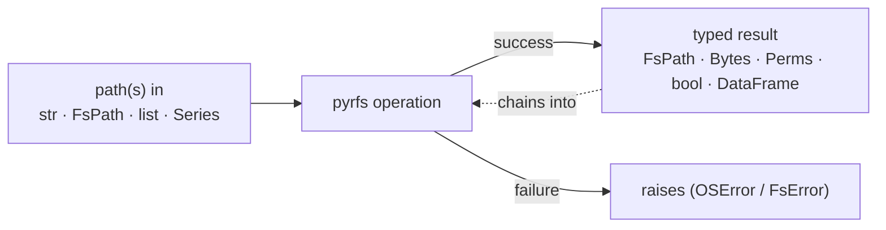
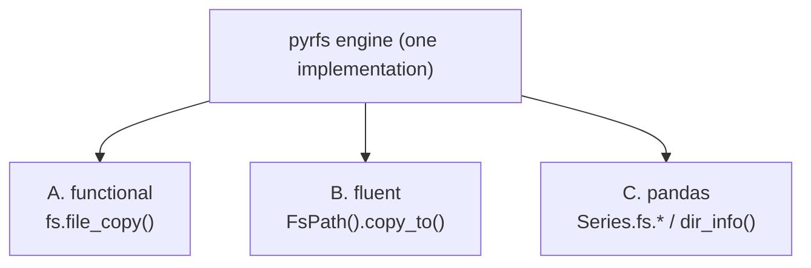

# pyrfs — UX Design

> A Pythonic port of R's [`fs`](https://fs.r-lib.org) · Status: **design draft** · Last updated: 2026-06-11
> Companion: [`pyrfs-architecture.md`](./pyrfs-architecture.md) (how it's built) · [`PROGRESS.md`](./PROGRESS.md)

This document defines the **feel** of pyrfs — names, return values, chaining, and the pandas
workflow. The guiding goal: an ex-R user who knows `fs` should feel at home immediately, and a
Python user should find it idiomatic and pipeable.

---

## 1. UX thesis

> **Every function takes path(s) in, and gives a predictable, path-carrying value back — or
> raises.** The same operation is reachable three ways: as a function, as a method on a path, or
> as a vectorized column operation in pandas.



We inherit the five `fs` promises — **consistent naming · vectorization · predictable returns ·
explicit failure · tidy UTF-8 paths** — and add a sixth: **three interchangeable surfaces**.

---

## 2. Naming — the four families (kept from `fs`)

Functions are grouped by the **noun** they act on, `noun_verb`, snake_case. Type `dir_` + Tab and
you see every directory operation.

| Prefix | Domain | Examples |
|--------|--------|----------|
| `path_` | construct & manipulate path strings (**no I/O**) | `path()`, `path_dir()`, `path_ext_set()`, `path_rel()`, `path_norm()` |
| `file_` | operate on files | `file_create()`, `file_copy()`, `file_info()`, `file_chmod()` |
| `dir_`  | operate on directories | `dir_create()`, `dir_ls()`, `dir_info()`, `dir_tree()` |
| `link_` | operate on links | `link_create()`, `link_path()`, `link_copy()` |

Plus predicates (`is_file`, `is_dir`, `is_link`, `is_file_empty`, `is_dir_empty`,
`is_absolute_path`), id helpers (`user_ids`, `group_ids`), and temp helpers (`file_temp`,
`path_temp`, `file_temp_push/pop`).

The create/copy/delete/exists verbs repeat with identical shapes across `file_`/`dir_`/`link_` —
a predictable matrix you learn once.

---

## 3. The three surfaces (same engine, your choice of style)

### Surface A — Functional (closest to R `fs`)

```python
import pyrfs as fs

fs.path("foo", "bar", "a", ext="txt")     # FsPath('foo/bar/a.txt')
fs.dir_ls("pyrfs", recurse=True, glob="*.py")
fs.file_copy("a.txt", "b.txt")            # -> FsPath('b.txt')
fs.path_ext_set("report.md", "html")      # FsPath('report.html')
```

### Surface B — Fluent `FsPath` (Pythonic chaining)

```python
from pyrfs import FsPath

(FsPath("foo") / "bar" / "a.txt")         # FsPath('foo/bar/a.txt')   <- '/' operator
(FsPath("data") / "raw.csv").with_ext("parquet").copy_to("clean/")
FsPath("project").mkdir().touch_file("README.md")
FsPath("logs").ls(glob="*.log")           # [FsPath, FsPath, ...]
```

`FsPath` **is a `str`** (subclass), so it works anywhere a path string is expected — `open(p)`,
`pd.read_csv(p)`, `os.fspath(p)` — no conversion needed.

### Surface C — pandas `.fs` accessor + DataFrame returns

```python
import pandas as pd
import pyrfs as fs

df = pd.DataFrame({"path": fs.dir_ls("pyrfs", recurse=True)})

df.assign(
    ext = df["path"].fs.ext(),            # vectorized over the column
    dir = df["path"].fs.dir(),
    ok  = df["path"].fs.exists(),
)
```



Pick per task: scripts lean A, OO code leans B, dataframe pipelines lean C. They interoperate —
`dir_ls()` returns `FsPath`s you can drop straight into a DataFrame column.

---

## 4. Predictable, typed return values

Every function returns one of a small, learnable set of shapes — and it always conveys the path.

| Return | Type | Produced by |
|--------|------|-------------|
| a path | `FsPath` (⊂ `str`) | `path()`, `file_copy()`, `dir_create()`, most verbs |
| many paths | `list[FsPath]` / `Series[path]` | `dir_ls()`, vectorized calls |
| existence/type test | `bool` / `dict`/`Series` of bool | `file_exists()`, `is_dir()` |
| a size | `Bytes` (⊂ `int`) | `file_size()` |
| permissions | `Perms` (⊂ `int`) | `file_info()["permissions"]` |
| a table | `DataFrame` (or `list[dict]`) | `file_info()`, `dir_info()` |

**Mutating verbs return the new path**, enabling chains and pipes:

```python
(fs.file_temp()
   .pipe(... )   # any callable
)
# fluent equivalent:
FsPath(fs.file_temp()).mkdir().touch_file("a").touch_file("b")
```

---

## 5. Typed values that read like a human

The heart of `fs`'s charm — values that *know what they are* and print accordingly.

| You have | pyrfs shows | And you can write |
|----------|-----------|-------------------|
| `455200` bytes | `445.2K` | `fs.file_size("x") > "10KB"` → `True` |
| mode `0o644` | `rw-r--r--` | `perms == "u=rw,go=r"` → `True` |
| `"src//a.txt"` | `src/a.txt` (tidy, coloured) | `FsPath("src") / "a.txt"` |

```python
from pyrfs import Bytes, Perms

Bytes("10MB")              # Bytes(10485760)  -> displays '10M'
Bytes(455200) < "1MB"      # True
sum([Bytes("1MB"), Bytes("500KB")])   # Bytes -> '1.46M'

Perms("644")               # Perms -> 'rw-r--r--'
Perms("644") & "u+r"       # Perms (bitwise), still prints rwx
Perms("644") == "rw-r--r--"  # True
```

In pandas these become **real column dtypes** (ExtensionArrays), so the R headline demo ports
almost verbatim:

```python
(fs.dir_info("pyrfs", recurse=False)
   .query("size > '10KB' and type == 'file'")     # Bytes column compares to a string
   .sort_values("size", ascending=False)
   .loc[:, ["path", "permissions", "size", "modification_time"]])
#                  path  permissions    size      modification_time
#   pyrfs/_engine/dirops.py  rw-r--r--   12.4K  2026-06-11 13:35:54
#   ...
```

---

## 6. The pandas pipe workflow (a first-class use case)

pyrfs is built to flow inside `.pipe()` chains because `*_info` returns a DataFrame and the `.fs`
accessor vectorizes path algebra over columns.

```python
import pyrfs as fs

big_modules = (
    fs.dir_info("pyrfs", recurse=True)
      .query("type == 'file'")
      .assign(stem=lambda d: d["path"].fs.name())
      .pipe(lambda d: d[d["path"].fs.ext() == "py"])
      .groupby(d_dir := lambda d: d["path"].fs.dir())  # group by directory
      .agg(total=("size", "sum"), n=("path", "size"))
      .sort_values("total", ascending=False)
)
```

Reading many files into one frame — `dir_ls()` returns paths you tag by source, the pandas
analogue of R's named-vector `map_df(.id=)` trick:

```python
files = fs.dir_ls("data", glob="*.tsv")
frame = pd.concat(
    {p.name(): pd.read_csv(p, sep="\t") for p in files},
    names=["file"],
)
```

---

## 7. Safe defaults & argument conventions (learn once)

| Argument | Meaning | Default | On |
|----------|---------|---------|-----|
| `overwrite` | allow clobbering an existing target | `False` (safe) | copy/move |
| `recurse` | recurse fully (`True`), not (`False`), or to depth (`int`) | `False` listing / `True` create | `dir_*` |
| `all` | include hidden dotfiles | `False` | `dir_ls`, `dir_map` |
| `type` | filter by entry type (`"file"`, `"directory"`, `"symlink"`, …) | `"any"` | `dir_ls`, `dir_info` |
| `glob` / `regexp` | filter listings (mutually exclusive → `FsError` if both) | `None` | `dir_ls`, `path_filter` |
| `fail` | raise (`True`) vs warn (`False`) on inaccessible entries | `True` | directory traversals |

- **Destructive actions opt-in.** `overwrite=False` and bounded `recurse` mean nothing surprising
  gets deleted or walked.
- **Keyword-only where it aids clarity** — flags like `overwrite`, `recurse`, `all` are
  keyword-only (`*,`) so call sites read self-documenting: `file_copy(a, b, overwrite=True)`.

---

## 8. Explicit failure (Pythonic)

pyrfs raises rather than silently returning a falsy value:

```python
fs.file_copy("a.txt", "b.txt")            # raises FileExistsError if b.txt exists
fs.file_copy("a.txt", "b.txt", overwrite=True)   # ok

fs.dir_ls("nope")                         # raises FileNotFoundError
fs.path_filter(paths, glob="*.py", regexp=r"\.py$")   # raises pyrfs.FsError: cannot set both

# soften a traversal when some entries are unreadable:
fs.dir_ls("/var", recurse=True, fail=False)   # warns + skips, returns what it could read
```

- Native `OSError` subclasses (`FileNotFoundError`, `FileExistsError`, `PermissionError`) for
  OS-level failures — familiar, `try/except`-able.
- `pyrfs.FsError` (with subclasses) for pyrfs validation — friendly, actionable messages.

---

## 9. R `fs` → pyrfs translation

| R `fs` | pyrfs functional | pyrfs fluent |
|--------|-----------------|-------------|
| `path("a", "b", ext = "txt")` | `path("a", "b", ext="txt")` | `FsPath("a") / "b"` then `.with_ext("txt")` |
| `dir_ls("d", recurse = TRUE)` | `dir_ls("d", recurse=True)` | `FsPath("d").ls(recurse=True)` |
| `dir_info("d")` | `dir_info("d")` → DataFrame | `FsPath("d").info()` |
| `file_copy("a", "b")` | `file_copy("a", "b")` | `FsPath("a").copy_to("b")` |
| `file_size("a")` | `file_size("a")` → `Bytes` | `FsPath("a").size()` |
| `path_ext_set("a.txt", "md")` | `path_ext_set("a.txt", "md")` | `FsPath("a.txt").with_ext("md")` |
| `path_rel("a/b", "a")` | `path_rel("a/b", "a")` | `FsPath("a/b").rel_to("a")` |
| `dir_tree("d")` | `dir_tree("d")` | `FsPath("d").tree()` |
| `x %>% file_delete()` | `df.pipe(...)` / loop | `FsPath(x).delete()` |

Naming is intentionally identical on the functional surface so muscle memory transfers; the fluent
surface adds Pythonic method names for OO-style chaining.

---

## 10. Small touches (ported from `fs`)

- **`dir_tree()`** prints a coloured box-drawing tree (`├──`, `└──`), like Unix `tree`.
- **`file_show()`** opens a file in the OS default app (cross-platform).
- **`path(..., ext=)`** builds extensions correctly (one dot, no doubling).
- **`path_sanitize()`** turns untrusted strings into safe filenames.
- **`path_rel()` / `path_common()`** — relative paths and longest common dir (no stdlib one-liner).
- **`file_temp_push()/pop()`** — deterministic temp names for reproducible docs/tests.
- **Colour degrades** automatically on non-TTY / `NO_COLOR`.

---

## 11. Sharp edges (honest notes)

- **Stricter than stdlib in places.** `file_copy` refuses to overwrite by default — porting loose
  scripts may surface `FileExistsError`. Opt in with `overwrite=True`.
- **No `dir_move`.** Directories move via `file_move` (dirs are files), matching `fs`.
- **`FsPath` is a `str`, not a `pathlib.Path`.** Great for interop and pandas; if you want
  `pathlib` semantics call `.as_pathlib()` (helper) — we don't pretend to be `Path`.
- **pandas-only features fail gracefully.** Without the `[pandas]` extra, `dir_info()` returns
  `list[dict]` and the `.fs` accessor is unavailable; the docstring says so.
- **ExtensionDtype edge cases.** Some exotic pandas ops on `Bytes`/`Perms` columns may need
  `.astype(int)` first in v1; comparisons, sorting, and `sum/min/max` are supported from the start.

---

## 12. Cheat-sheet

```
NOUN_VERB(path, ...)              families: path_ file_ dir_ link_   (+ is_*, *_ids, *_temp)
  ├─ path(s) in                  str · FsPath · list · pandas.Series  (vectorized)
  ├─ tidy FsPath out             always '/', no '//' or trailing '/', UTF-8
  ├─ typed result                FsPath · Bytes('445.2K') · Perms('rwxr-xr-x') · DataFrame
  └─ raises on failure           OSError subclasses · pyrfs.FsError ; fail=False to soften

three surfaces:  fs.file_copy(a,b)  ·  FsPath(a).copy_to(b)  ·  df['p'].fs.ext()
pandas pipe:     dir_info(d).query("size > '10KB'").sort_values('size')
safe defaults:   overwrite=False · recurse=False(list)/True(create) · all=False · fail=True
from R fs:       same functional names; fluent adds Pythonic methods
```
